# signal — Architectural Topology
> Generated 2026-05-26 · Graph eca5147f

64 nodes · 37 edges

## Dependency Graph

```mermaid
graph TD
  %% modules
  signal_app_ad70e8["signal-app"]
  %% services
  DocumentStore_cc5f50("DocumentStore")
  SyncEngine_0daf85("SyncEngine")
  ClockProvider_f755e3("ClockProvider")
  SyncManager_cebc71("SyncManager")
  DocumentStore_439032("DocumentStore")
  SyncEngine_e2526c("SyncEngine")
  ClockProvider_82d6c8("ClockProvider")
  SyncManager_70de28("SyncManager")
  app_f6d0eb("app")
  %% entitys
  Summarizer_fad196[["Summarizer"]]
  LocalSummarizer_2a6a7f[["LocalSummarizer"]]
  RemoteSummarizer_3690a3[["RemoteSummarizer"]]
  DocumentReader_7f179e[["DocumentReader"]]
  PresenceStatus_90b51e[["PresenceStatus"]]
  PeerPresence_104580[["PeerPresence"]]
  PresenceTracker_e22b19[["PresenceTracker"]]
  AppConfig_bf0b58[["AppConfig"]]
  SignalApp_30f8fa[["SignalApp"]]
  Document_426f17[["Document"]]
  DocumentSnapshot_01246f[["DocumentSnapshot"]]
  DocumentLink_55a54c[["DocumentLink"]]
  LinkKind_2cd060[["LinkKind"]]
  SearchQuery_ea6107[["SearchQuery"]]
  SearchResult_caba73[["SearchResult"]]
  SearchResultSnapshot_4ef30f[["SearchResultSnapshot"]]
  DocumentChange_69102f[["DocumentChange"]]
  GraphNode_03f3b5[["GraphNode"]]
  AdjacencyList_bf3225[["AdjacencyList"]]
  GraphBuilder_4e5d87[["GraphBuilder"]]
  IndexStats_982ee5[["IndexStats"]]
  SearchHit_cbfd3b[["SearchHit"]]
  InvertedIndex_d1a8a2[["InvertedIndex"]]
  ExportPlugin_68893b[["ExportPlugin"]]
  Plugin_326570[["Plugin"]]
  PluginContext_ca5e37[["PluginContext"]]
  PluginHost_d061df[["PluginHost"]]
  SearchPlugin_7f363b[["SearchPlugin"]]
  StorageEventType_605ed1[["StorageEventType"]]
  StorageEventCreated_1dc4da[["StorageEventCreated"]]
  StorageEventUpdated_bb146f[["StorageEventUpdated"]]
  StorageEventDeleted_ea951b[["StorageEventDeleted"]]
  StorageEventLinked_f9408b[["StorageEventLinked"]]
  StorageEvent_31eee6[["StorageEvent"]]
  StorageEventBusContract_bf10e1[["StorageEventBusContract"]]
  StorageEventBus_a2690d[["StorageEventBus"]]
  ConflictCandidate_30da52[["ConflictCandidate"]]
  ConflictResolution_8f3753[["ConflictResolution"]]
  TransportSend_718bc2[["TransportSend"]]
  SyncManagerOptions_6eb0c2[["SyncManagerOptions"]]
  SyncState_8fc937[["SyncState"]]
  ConflictStrategy_41e9af[["ConflictStrategy"]]
  PeerInfo_8fcc71[["PeerInfo"]]
  SyncAck_00c6f0[["SyncAck"]]
  ConflictRecord_923299[["ConflictRecord"]]
  VectorClock_3a8080[["VectorClock"]]
  SyncMessage_3876b5[["SyncMessage"]]
  QueueEntry_485b37[["QueueEntry"]]
  SyncQueueOptions_f1f88f[["SyncQueueOptions"]]
  SyncQueue_7f298f[["SyncQueue"]]
  PeerSession_400578[["PeerSession"]]
  DocumentVersion_82f420[["DocumentVersion"]]
  VersionDiff_5ffc9b[["VersionDiff"]]
  VersionHistory_5bf520[["VersionHistory"]]

  %% relationships
  PresenceTracker_e22b19 -->|"imports"| PluginHost_d061df
  SignalApp_30f8fa -->|"imports"| DocumentStore_439032
  SignalApp_30f8fa -->|"imports"| StorageEventBus_a2690d
  SignalApp_30f8fa -->|"imports"| GraphBuilder_4e5d87
  SignalApp_30f8fa -->|"imports"| PluginHost_d061df
  SignalApp_30f8fa -->|"imports"| SyncEngine_e2526c
  SignalApp_30f8fa -->|"imports"| PresenceTracker_e22b19
  SignalApp_30f8fa -->|"imports"| RemoteSummarizer_3690a3
  ExportPlugin_68893b -->|"imports"| PluginHost_d061df
  PluginHost_d061df -->|"imports"| StorageEventBus_a2690d
  SearchPlugin_7f363b -->|"imports"| PluginHost_d061df
  DocumentStore_439032 -->|"imports"| StorageEventBus_a2690d
  SyncEngine_e2526c -->|"imports"| StorageEventBus_a2690d
  SyncManager_70de28 -->|"imports"| DocumentStore_439032
  SyncManager_70de28 -->|"imports"| StorageEventBus_a2690d
  SyncManager_70de28 -->|"imports"| SyncEngine_e2526c
  SyncManager_70de28 -->|"imports"| SyncQueue_7f298f
  SyncManager_70de28 -->|"imports"| PeerSession_400578
  signal_app_ad70e8 --o|"owns"| DocumentStore_cc5f50
  signal_app_ad70e8 --o|"owns"| SyncEngine_0daf85
  signal_app_ad70e8 --o|"owns"| SyncManager_cebc71
  signal_app_ad70e8 --o|"owns"| DocumentStore_439032
  signal_app_ad70e8 --o|"owns"| SyncEngine_e2526c
  signal_app_ad70e8 --o|"owns"| SyncManager_70de28
  signal_app_ad70e8 --o|"owns"| LocalSummarizer_2a6a7f
  signal_app_ad70e8 --o|"owns"| RemoteSummarizer_3690a3
  signal_app_ad70e8 --o|"owns"| PresenceTracker_e22b19
  signal_app_ad70e8 --o|"owns"| SignalApp_30f8fa
  signal_app_ad70e8 --o|"owns"| GraphBuilder_4e5d87
  signal_app_ad70e8 --o|"owns"| InvertedIndex_d1a8a2
  signal_app_ad70e8 --o|"owns"| ExportPlugin_68893b
  signal_app_ad70e8 --o|"owns"| PluginHost_d061df
  signal_app_ad70e8 --o|"owns"| SearchPlugin_7f363b
  signal_app_ad70e8 --o|"owns"| StorageEventBus_a2690d
  signal_app_ad70e8 --o|"owns"| SyncQueue_7f298f
  signal_app_ad70e8 --o|"owns"| PeerSession_400578
  signal_app_ad70e8 --o|"owns"| VersionHistory_5bf520

  %% styles
  classDef moduleStyle fill:#1e3a5f,stroke:#4a9eff,color:#e8f4fd
  classDef serviceStyle fill:#1e3d2f,stroke:#4aff8e,color:#e8fdf0
  classDef workflowStyle fill:#3d2f1e,stroke:#ffa54a,color:#fdf0e8
  classDef entityStyle fill:#2f1e3d,stroke:#c54aff,color:#f0e8fd
  class signal_app_ad70e8 moduleStyle
  class DocumentStore_cc5f50,SyncEngine_0daf85,ClockProvider_f755e3,SyncManager_cebc71,DocumentStore_439032,SyncEngine_e2526c,ClockProvider_82d6c8,SyncManager_70de28,app_f6d0eb serviceStyle
  class Summarizer_fad196,LocalSummarizer_2a6a7f,RemoteSummarizer_3690a3,DocumentReader_7f179e,PresenceStatus_90b51e,PeerPresence_104580,PresenceTracker_e22b19,AppConfig_bf0b58,SignalApp_30f8fa,Document_426f17,DocumentSnapshot_01246f,DocumentLink_55a54c,LinkKind_2cd060,SearchQuery_ea6107,SearchResult_caba73,SearchResultSnapshot_4ef30f,DocumentChange_69102f,GraphNode_03f3b5,AdjacencyList_bf3225,GraphBuilder_4e5d87,IndexStats_982ee5,SearchHit_cbfd3b,InvertedIndex_d1a8a2,ExportPlugin_68893b,Plugin_326570,PluginContext_ca5e37,PluginHost_d061df,SearchPlugin_7f363b,StorageEventType_605ed1,StorageEventCreated_1dc4da,StorageEventUpdated_bb146f,StorageEventDeleted_ea951b,StorageEventLinked_f9408b,StorageEvent_31eee6,StorageEventBusContract_bf10e1,StorageEventBus_a2690d,ConflictCandidate_30da52,ConflictResolution_8f3753,TransportSend_718bc2,SyncManagerOptions_6eb0c2,SyncState_8fc937,ConflictStrategy_41e9af,PeerInfo_8fcc71,SyncAck_00c6f0,ConflictRecord_923299,VectorClock_3a8080,SyncMessage_3876b5,QueueEntry_485b37,SyncQueueOptions_f1f88f,SyncQueue_7f298f,PeerSession_400578,DocumentVersion_82f420,VersionDiff_5ffc9b,VersionHistory_5bf520 entityStyle
```

## Coupling Table

| Label | Kind | Fan-In | Fan-Out | Total |
|---|---|---|---|---|
| signal-app | module | 0 | 19 | 19 |
| SignalApp | entity | 1 | 7 | 8 |
| SyncManager | service | 1 | 5 | 6 |
| PluginHost | entity | 5 | 1 | 6 |
| StorageEventBus | entity | 6 | 0 | 6 |
| DocumentStore | service | 3 | 1 | 4 |
| SyncEngine | service | 3 | 1 | 4 |
| PresenceTracker | entity | 2 | 1 | 3 |
| RemoteSummarizer | entity | 2 | 0 | 2 |
| GraphBuilder | entity | 2 | 0 | 2 |
| ExportPlugin | entity | 1 | 1 | 2 |
| SearchPlugin | entity | 1 | 1 | 2 |
| SyncQueue | entity | 2 | 0 | 2 |
| PeerSession | entity | 2 | 0 | 2 |
| DocumentStore | service | 1 | 0 | 1 |
| SyncEngine | service | 1 | 0 | 1 |
| SyncManager | service | 1 | 0 | 1 |
| LocalSummarizer | entity | 1 | 0 | 1 |
| InvertedIndex | entity | 1 | 0 | 1 |
| VersionHistory | entity | 1 | 0 | 1 |

## Next Steps

- `loom invariants [module]` — list formalized invariants for a module
- `loom derive` — generate artifacts from current graph state
- `loom drift [dir]` — detect code drift from crystallized evidence
- `loom topology --adapt` — run adaptive topology cycle
