# signal — Architectural Topology
> Generated 2026-05-25 · Graph 8314e077

57 nodes · 38 edges

## Dependency Graph

```mermaid
graph TD
  %% modules
  signal_app_f6caef["signal-app"]
  %% services
  DocumentStore_941145("DocumentStore")
  SyncEngine_985eef("SyncEngine")
  SyncManager_e25bfd("SyncManager")
  DocumentStore_8232e3("DocumentStore")
  SyncEngine_b752ca("SyncEngine")
  SyncManager_184359("SyncManager")
  app_292a4f("app")
  %% entitys
  Summarizer_3c3b06[["Summarizer"]]
  LocalSummarizer_67bd49[["LocalSummarizer"]]
  PresenceStatus_c8eac9[["PresenceStatus"]]
  PeerPresence_6fcd28[["PeerPresence"]]
  PresenceTracker_932502[["PresenceTracker"]]
  AppConfig_082c97[["AppConfig"]]
  SignalApp_472e03[["SignalApp"]]
  Document_971d43[["Document"]]
  DocumentLink_e93312[["DocumentLink"]]
  LinkKind_47e6af[["LinkKind"]]
  SearchQuery_8e5707[["SearchQuery"]]
  SearchResult_d4f61c[["SearchResult"]]
  DocumentChange_af296a[["DocumentChange"]]
  GraphNode_7b0885[["GraphNode"]]
  AdjacencyList_4619d5[["AdjacencyList"]]
  GraphBuilder_a6b39f[["GraphBuilder"]]
  IndexStats_6c14c8[["IndexStats"]]
  SearchHit_6e7662[["SearchHit"]]
  InvertedIndex_59ab00[["InvertedIndex"]]
  ExportPlugin_b8fce9[["ExportPlugin"]]
  Plugin_d31f86[["Plugin"]]
  PluginContext_df3580[["PluginContext"]]
  PluginHost_022d40[["PluginHost"]]
  SearchPlugin_2cf675[["SearchPlugin"]]
  StorageEventType_37e898[["StorageEventType"]]
  StorageEventCreated_c856b0[["StorageEventCreated"]]
  StorageEventUpdated_037dce[["StorageEventUpdated"]]
  StorageEventDeleted_667a8b[["StorageEventDeleted"]]
  StorageEventLinked_d74a73[["StorageEventLinked"]]
  StorageEvent_b74059[["StorageEvent"]]
  StorageEventBus_602313[["StorageEventBus"]]
  ConflictCandidate_bd19af[["ConflictCandidate"]]
  ConflictResolution_2372ca[["ConflictResolution"]]
  TransportSend_b0bfed[["TransportSend"]]
  SyncManagerOptions_727b18[["SyncManagerOptions"]]
  SyncState_8b72fd[["SyncState"]]
  ConflictStrategy_b398cc[["ConflictStrategy"]]
  PeerInfo_4459b4[["PeerInfo"]]
  SyncAck_bdc13c[["SyncAck"]]
  ConflictRecord_ea6972[["ConflictRecord"]]
  VectorClock_e548b7[["VectorClock"]]
  SyncMessage_4491ef[["SyncMessage"]]
  QueueEntry_371759[["QueueEntry"]]
  SyncQueueOptions_bd1d53[["SyncQueueOptions"]]
  SyncQueue_62c71f[["SyncQueue"]]
  PeerSession_feb7c9[["PeerSession"]]
  DocumentVersion_f5fed1[["DocumentVersion"]]
  VersionDiff_d26c4d[["VersionDiff"]]
  VersionHistory_bfa56a[["VersionHistory"]]

  %% relationships
  PresenceTracker_932502 -->|"imports"| DocumentStore_8232e3
  PresenceTracker_932502 -->|"imports"| SyncEngine_b752ca
  SignalApp_472e03 -->|"imports"| DocumentStore_8232e3
  SignalApp_472e03 -->|"imports"| StorageEventBus_602313
  SignalApp_472e03 -->|"imports"| GraphBuilder_a6b39f
  SignalApp_472e03 -->|"imports"| PluginHost_022d40
  SignalApp_472e03 -->|"imports"| SyncEngine_b752ca
  SignalApp_472e03 -->|"imports"| LocalSummarizer_67bd49
  GraphBuilder_a6b39f -->|"imports"| DocumentStore_8232e3
  ExportPlugin_b8fce9 -->|"imports"| PluginHost_022d40
  SearchPlugin_2cf675 -->|"imports"| PluginHost_022d40
  SearchPlugin_2cf675 -->|"imports"| DocumentStore_8232e3
  DocumentStore_8232e3 -->|"imports"| StorageEventBus_602313
  SyncEngine_b752ca -->|"imports"| DocumentStore_8232e3
  SyncEngine_b752ca -->|"imports"| StorageEventBus_602313
  SyncManager_184359 -->|"imports"| DocumentStore_8232e3
  SyncManager_184359 -->|"imports"| StorageEventBus_602313
  SyncManager_184359 -->|"imports"| SyncEngine_b752ca
  SyncManager_184359 -->|"imports"| SyncQueue_62c71f
  SyncManager_184359 -->|"imports"| PeerSession_feb7c9
  signal_app_f6caef --o|"owns"| DocumentStore_941145
  signal_app_f6caef --o|"owns"| SyncEngine_985eef
  signal_app_f6caef --o|"owns"| SyncManager_e25bfd
  signal_app_f6caef --o|"owns"| DocumentStore_8232e3
  signal_app_f6caef --o|"owns"| SyncEngine_b752ca
  signal_app_f6caef --o|"owns"| SyncManager_184359
  signal_app_f6caef --o|"owns"| LocalSummarizer_67bd49
  signal_app_f6caef --o|"owns"| PresenceTracker_932502
  signal_app_f6caef --o|"owns"| SignalApp_472e03
  signal_app_f6caef --o|"owns"| GraphBuilder_a6b39f
  signal_app_f6caef --o|"owns"| InvertedIndex_59ab00
  signal_app_f6caef --o|"owns"| ExportPlugin_b8fce9
  signal_app_f6caef --o|"owns"| PluginHost_022d40
  signal_app_f6caef --o|"owns"| SearchPlugin_2cf675
  signal_app_f6caef --o|"owns"| StorageEventBus_602313
  signal_app_f6caef --o|"owns"| SyncQueue_62c71f
  signal_app_f6caef --o|"owns"| PeerSession_feb7c9
  signal_app_f6caef --o|"owns"| VersionHistory_bfa56a

  %% styles
  classDef moduleStyle fill:#1e3a5f,stroke:#4a9eff,color:#e8f4fd
  classDef serviceStyle fill:#1e3d2f,stroke:#4aff8e,color:#e8fdf0
  classDef workflowStyle fill:#3d2f1e,stroke:#ffa54a,color:#fdf0e8
  classDef entityStyle fill:#2f1e3d,stroke:#c54aff,color:#f0e8fd
  class signal_app_f6caef moduleStyle
  class DocumentStore_941145,SyncEngine_985eef,SyncManager_e25bfd,DocumentStore_8232e3,SyncEngine_b752ca,SyncManager_184359,app_292a4f serviceStyle
  class Summarizer_3c3b06,LocalSummarizer_67bd49,PresenceStatus_c8eac9,PeerPresence_6fcd28,PresenceTracker_932502,AppConfig_082c97,SignalApp_472e03,Document_971d43,DocumentLink_e93312,LinkKind_47e6af,SearchQuery_8e5707,SearchResult_d4f61c,DocumentChange_af296a,GraphNode_7b0885,AdjacencyList_4619d5,GraphBuilder_a6b39f,IndexStats_6c14c8,SearchHit_6e7662,InvertedIndex_59ab00,ExportPlugin_b8fce9,Plugin_d31f86,PluginContext_df3580,PluginHost_022d40,SearchPlugin_2cf675,StorageEventType_37e898,StorageEventCreated_c856b0,StorageEventUpdated_037dce,StorageEventDeleted_667a8b,StorageEventLinked_d74a73,StorageEvent_b74059,StorageEventBus_602313,ConflictCandidate_bd19af,ConflictResolution_2372ca,TransportSend_b0bfed,SyncManagerOptions_727b18,SyncState_8b72fd,ConflictStrategy_b398cc,PeerInfo_4459b4,SyncAck_bdc13c,ConflictRecord_ea6972,VectorClock_e548b7,SyncMessage_4491ef,QueueEntry_371759,SyncQueueOptions_bd1d53,SyncQueue_62c71f,PeerSession_feb7c9,DocumentVersion_f5fed1,VersionDiff_d26c4d,VersionHistory_bfa56a entityStyle
```

## Coupling Table

| Label | Kind | Fan-In | Fan-Out | Total |
|---|---|---|---|---|
| signal-app | module | 0 | 18 | 18 |
| DocumentStore | service | 7 | 1 | 8 |
| SignalApp | entity | 1 | 6 | 7 |
| SyncEngine | service | 4 | 2 | 6 |
| SyncManager | service | 1 | 5 | 6 |
| StorageEventBus | entity | 5 | 0 | 5 |
| PluginHost | entity | 4 | 0 | 4 |
| PresenceTracker | entity | 1 | 2 | 3 |
| GraphBuilder | entity | 2 | 1 | 3 |
| SearchPlugin | entity | 1 | 2 | 3 |
| LocalSummarizer | entity | 2 | 0 | 2 |
| ExportPlugin | entity | 1 | 1 | 2 |
| SyncQueue | entity | 2 | 0 | 2 |
| PeerSession | entity | 2 | 0 | 2 |
| DocumentStore | service | 1 | 0 | 1 |
| SyncEngine | service | 1 | 0 | 1 |
| SyncManager | service | 1 | 0 | 1 |
| InvertedIndex | entity | 1 | 0 | 1 |
| VersionHistory | entity | 1 | 0 | 1 |
| app | service | 0 | 0 | 0 |

## Next Steps

- `loom invariants [module]` — list formalized invariants for a module
- `loom derive` — generate artifacts from current graph state
- `loom drift [dir]` — detect code drift from crystallized evidence
- `loom topology --adapt` — run adaptive topology cycle
