# signal — Architectural Topology
> Generated 2026-05-31 · Graph a306cbd3

75 nodes · 41 edges

## Dependency Graph

```mermaid
graph TD
  %% modules
  signal_app_0a42b5["signal-app"]
  src_06e7ad["src"]
  %% services
  SnapshotStore_a9c50b("SnapshotStore")
  FileSnapshotStore_fc5873("FileSnapshotStore")
  DocumentSnapshotService_aed36b("DocumentSnapshotService")
  DiskDocumentSnapshotStore_111631("DiskDocumentSnapshotStore")
  DocumentStore_a60736("DocumentStore")
  SyncEngine_4764f1("SyncEngine")
  SyncManager_22ab88("SyncManager")
  SnapshotStore_08092b("SnapshotStore")
  FileSnapshotStore_85ecb8("FileSnapshotStore")
  DocumentSnapshotService_1358ad("DocumentSnapshotService")
  DiskDocumentSnapshotStore_2d544b("DiskDocumentSnapshotStore")
  DocumentStore_eb3bc6("DocumentStore")
  SyncEngine_fb98e0("SyncEngine")
  SyncManager_778cfa("SyncManager")
  app_ca5c1d("app")
  %% entitys
  LocalSummarizer_25be22[["LocalSummarizer"]]
  PeerPresence_9e0f76[["PeerPresence"]]
  PresenceTracker_05c222[["PresenceTracker"]]
  SignalApp_26e81e[["SignalApp"]]
  Document_96aaa5[["Document"]]
  AppConfig_e844a3[["AppConfig"]]
  VectorClock_c6d291[["VectorClock"]]
  SyncState_e2d9fc[["SyncState"]]
  ConflictStrategy_a1a32b[["ConflictStrategy"]]
  PeerInfo_b98286[["PeerInfo"]]
  SyncAck_8c6af6[["SyncAck"]]
  ConflictRecord_858a01[["ConflictRecord"]]
  SyncMessage_fe5df1[["SyncMessage"]]
  OfflineEntry_ca0df4[["OfflineEntry"]]
  OfflineSyncQueueOptions_40b758[["OfflineSyncQueueOptions"]]
  OfflineSyncQueue_52812d[["OfflineSyncQueue"]]
  SyncManagerOptions_e7a7e0[["SyncManagerOptions"]]
  ConflictCandidate_eeadae[["ConflictCandidate"]]
  ConflictCandidateRecord_d7a8ef[["ConflictCandidateRecord"]]
  DocumentSnapshot_61ece9[["DocumentSnapshot"]]
  DocumentLink_97aebf[["DocumentLink"]]
  LinkKind_c6632e[["LinkKind"]]
  SearchQuery_38c355[["SearchQuery"]]
  SearchResult_78c812[["SearchResult"]]
  SearchResultSnapshot_671ee4[["SearchResultSnapshot"]]
  DocumentChange_17ea1f[["DocumentChange"]]
  GraphBuilder_d8372f[["GraphBuilder"]]
  Indexer_ae8e7a[["Indexer"]]
  WorkerPool_b53c9f[["WorkerPool"]]
  ExportPlugin_d93197[["ExportPlugin"]]
  HealthPlugin_4dedad[["HealthPlugin"]]
  StorageEventType_d09f4f[["StorageEventType"]]
  Plugin_484d88[["Plugin"]]
  PluginContext_4f4d70[["PluginContext"]]
  PluginHost_12ec6a[["PluginHost"]]
  SearchPlugin_d0dc15[["SearchPlugin"]]
  StorageEvent_436933[["StorageEvent"]]
  Listener_e32682[["Listener"]]
  StorageEventBusContract_59fd9f[["StorageEventBusContract"]]
  StorageEventBus_1ebfb4[["StorageEventBus"]]
  ScopedStorageEventBusContract_523c5d[["ScopedStorageEventBusContra…"]]
  ScopedStorageEventBus_b49ef8[["ScopedStorageEventBus"]]
  TransportSend_3ea378[["TransportSend"]]
  QueueEntry_3245a8[["QueueEntry"]]
  SyncQueueOptions_d7d5fa[["SyncQueueOptions"]]
  SyncQueue_fcc2bc[["SyncQueue"]]
  SyncSessionState_bda3eb[["SyncSessionState"]]
  SyncSessionEvent_a0e6ce[["SyncSessionEvent"]]
  SyncSessionTrackerOptions_30e228[["SyncSessionTrackerOptions"]]
  SyncSessionTracker_1d13a4[["SyncSessionTracker"]]
  PeerSession_3c3dcd[["PeerSession"]]
  TelemetryEvent_65cb21[["TelemetryEvent"]]
  DocumentVersion_a4961d[["DocumentVersion"]]
  VersionDiff_282938[["VersionDiff"]]
  VersionHistory_c54113[["VersionHistory"]]
  InvertedIndex_066b5a[["InvertedIndex"]]
  IndexStats_fb8cd2[["IndexStats"]]
  SearchHit_078a31[["SearchHit"]]

  %% relationships
  SignalApp_26e81e -->|"imports"| StorageEventBus_1ebfb4
  SignalApp_26e81e -->|"imports"| DocumentStore_eb3bc6
  SignalApp_26e81e -->|"imports"| GraphBuilder_d8372f
  SignalApp_26e81e -->|"imports"| SyncEngine_fb98e0
  Indexer_ae8e7a -->|"imports"| WorkerPool_b53c9f
  ScopedStorageEventBus_b49ef8 -->|"imports"| StorageEventBus_1ebfb4
  DocumentSnapshotService_1358ad -->|"imports"| DiskDocumentSnapshotStore_2d544b
  DocumentStore_eb3bc6 -->|"imports"| StorageEventBus_1ebfb4
  SyncManager_778cfa -->|"imports"| DocumentStore_eb3bc6
  SyncManager_778cfa -->|"imports"| SyncEngine_fb98e0
  SyncManager_778cfa -->|"imports"| SyncQueue_fcc2bc
  SyncManager_778cfa -->|"imports"| PeerSession_3c3dcd
  signal_app_0a42b5 --o|"owns"| FileSnapshotStore_fc5873
  signal_app_0a42b5 --o|"owns"| DocumentSnapshotService_aed36b
  signal_app_0a42b5 --o|"owns"| DiskDocumentSnapshotStore_111631
  signal_app_0a42b5 --o|"owns"| DocumentStore_a60736
  signal_app_0a42b5 --o|"owns"| SyncEngine_4764f1
  signal_app_0a42b5 --o|"owns"| SyncManager_22ab88
  signal_app_0a42b5 --o|"owns"| FileSnapshotStore_85ecb8
  signal_app_0a42b5 --o|"owns"| DocumentSnapshotService_1358ad
  signal_app_0a42b5 --o|"owns"| DiskDocumentSnapshotStore_2d544b
  signal_app_0a42b5 --o|"owns"| DocumentStore_eb3bc6
  signal_app_0a42b5 --o|"owns"| SyncEngine_fb98e0
  signal_app_0a42b5 --o|"owns"| SyncManager_778cfa
  signal_app_0a42b5 --o|"owns"| LocalSummarizer_25be22
  signal_app_0a42b5 --o|"owns"| PresenceTracker_05c222
  signal_app_0a42b5 --o|"owns"| SignalApp_26e81e
  signal_app_0a42b5 --o|"owns"| OfflineSyncQueue_52812d
  signal_app_0a42b5 --o|"owns"| GraphBuilder_d8372f
  signal_app_0a42b5 --o|"owns"| Indexer_ae8e7a
  signal_app_0a42b5 --o|"owns"| WorkerPool_b53c9f
  signal_app_0a42b5 --o|"owns"| ExportPlugin_d93197
  signal_app_0a42b5 --o|"owns"| HealthPlugin_4dedad
  signal_app_0a42b5 --o|"owns"| PluginHost_12ec6a
  signal_app_0a42b5 --o|"owns"| SearchPlugin_d0dc15
  signal_app_0a42b5 --o|"owns"| StorageEventBus_1ebfb4
  signal_app_0a42b5 --o|"owns"| ScopedStorageEventBus_b49ef8
  signal_app_0a42b5 --o|"owns"| SyncQueue_fcc2bc
  signal_app_0a42b5 --o|"owns"| SyncSessionTracker_1d13a4
  signal_app_0a42b5 --o|"owns"| PeerSession_3c3dcd
  signal_app_0a42b5 --o|"owns"| VersionHistory_c54113

  %% styles
  classDef moduleStyle fill:#1e3a5f,stroke:#4a9eff,color:#e8f4fd
  classDef serviceStyle fill:#1e3d2f,stroke:#4aff8e,color:#e8fdf0
  classDef workflowStyle fill:#3d2f1e,stroke:#ffa54a,color:#fdf0e8
  classDef entityStyle fill:#2f1e3d,stroke:#c54aff,color:#f0e8fd
  class signal_app_0a42b5,src_06e7ad moduleStyle
  class SnapshotStore_a9c50b,FileSnapshotStore_fc5873,DocumentSnapshotService_aed36b,DiskDocumentSnapshotStore_111631,DocumentStore_a60736,SyncEngine_4764f1,SyncManager_22ab88,SnapshotStore_08092b,FileSnapshotStore_85ecb8,DocumentSnapshotService_1358ad,DiskDocumentSnapshotStore_2d544b,DocumentStore_eb3bc6,SyncEngine_fb98e0,SyncManager_778cfa,app_ca5c1d serviceStyle
  class LocalSummarizer_25be22,PeerPresence_9e0f76,PresenceTracker_05c222,SignalApp_26e81e,Document_96aaa5,AppConfig_e844a3,VectorClock_c6d291,SyncState_e2d9fc,ConflictStrategy_a1a32b,PeerInfo_b98286,SyncAck_8c6af6,ConflictRecord_858a01,SyncMessage_fe5df1,OfflineEntry_ca0df4,OfflineSyncQueueOptions_40b758,OfflineSyncQueue_52812d,SyncManagerOptions_e7a7e0,ConflictCandidate_eeadae,ConflictCandidateRecord_d7a8ef,DocumentSnapshot_61ece9,DocumentLink_97aebf,LinkKind_c6632e,SearchQuery_38c355,SearchResult_78c812,SearchResultSnapshot_671ee4,DocumentChange_17ea1f,GraphBuilder_d8372f,Indexer_ae8e7a,WorkerPool_b53c9f,ExportPlugin_d93197,HealthPlugin_4dedad,StorageEventType_d09f4f,Plugin_484d88,PluginContext_4f4d70,PluginHost_12ec6a,SearchPlugin_d0dc15,StorageEvent_436933,Listener_e32682,StorageEventBusContract_59fd9f,StorageEventBus_1ebfb4,ScopedStorageEventBusContract_523c5d,ScopedStorageEventBus_b49ef8,TransportSend_3ea378,QueueEntry_3245a8,SyncQueueOptions_d7d5fa,SyncQueue_fcc2bc,SyncSessionState_bda3eb,SyncSessionEvent_a0e6ce,SyncSessionTrackerOptions_30e228,SyncSessionTracker_1d13a4,PeerSession_3c3dcd,TelemetryEvent_65cb21,DocumentVersion_a4961d,VersionDiff_282938,VersionHistory_c54113,InvertedIndex_066b5a,IndexStats_fb8cd2,SearchHit_078a31 entityStyle
```

## Coupling Table

| Label | Kind | Fan-In | Fan-Out | Total |
|---|---|---|---|---|
| signal-app | module | 0 | 29 | 29 |
| SyncManager | service | 1 | 4 | 5 |
| SignalApp | entity | 1 | 4 | 5 |
| DocumentStore | service | 3 | 1 | 4 |
| StorageEventBus | entity | 4 | 0 | 4 |
| SyncEngine | service | 3 | 0 | 3 |
| DocumentSnapshotService | service | 1 | 1 | 2 |
| DiskDocumentSnapshotStore | service | 2 | 0 | 2 |
| GraphBuilder | entity | 2 | 0 | 2 |
| Indexer | entity | 1 | 1 | 2 |
| WorkerPool | entity | 2 | 0 | 2 |
| ScopedStorageEventBus | entity | 1 | 1 | 2 |
| SyncQueue | entity | 2 | 0 | 2 |
| PeerSession | entity | 2 | 0 | 2 |
| FileSnapshotStore | service | 1 | 0 | 1 |
| DocumentSnapshotService | service | 1 | 0 | 1 |
| DiskDocumentSnapshotStore | service | 1 | 0 | 1 |
| DocumentStore | service | 1 | 0 | 1 |
| SyncEngine | service | 1 | 0 | 1 |
| SyncManager | service | 1 | 0 | 1 |

## Next Steps

- `loom invariants [module]` — list formalized invariants for a module
- `loom derive` — generate artifacts from current graph state
- `loom drift [dir]` — detect code drift from crystallized evidence
- `loom topology --adapt` — run adaptive topology cycle
