# signal — Architectural Topology
> Generated 2026-05-29 · Graph 1c5d5f2e

82 nodes · 49 edges

## Dependency Graph

```mermaid
graph TD
  %% modules
  signal_app_5dec41["signal-app"]
  %% services
  DeprecatedDocumentStore_726d31("DeprecatedDocumentStore")
  FileSnapshotStore_64e348("FileSnapshotStore")
  SnapshotStore_4b630e("SnapshotStore")
  DocumentSnapshotService_c2b75b("DocumentSnapshotService")
  DiskDocumentSnapshotStore_a6cf5c("DiskDocumentSnapshotStore")
  DocumentStore_ed86b2("DocumentStore")
  SyncEngine_b74390("SyncEngine")
  SyncManager_c2014d("SyncManager")
  DeprecatedDocumentStore_bb08c3("DeprecatedDocumentStore")
  FileSnapshotStore_ff96e5("FileSnapshotStore")
  SnapshotStore_4079a4("SnapshotStore")
  DocumentSnapshotService_1b9098("DocumentSnapshotService")
  DiskDocumentSnapshotStore_a00f21("DiskDocumentSnapshotStore")
  DocumentStore_0bfdba("DocumentStore")
  SyncEngine_ad0d51("SyncEngine")
  SyncManager_1f696c("SyncManager")
  app_eca656("app")
  %% entitys
  LocalSummarizer_b10458[["LocalSummarizer"]]
  PeerPresence_640ff4[["PeerPresence"]]
  PresenceTracker_cf7abb[["PresenceTracker"]]
  AppConfig_964ada[["AppConfig"]]
  SignalApp_87b561[["SignalApp"]]
  Document_3b0869[["Document"]]
  DocumentSnapshot_42f1e4[["DocumentSnapshot"]]
  DocumentLink_146752[["DocumentLink"]]
  LinkKind_2c3d8a[["LinkKind"]]
  SearchQuery_d52649[["SearchQuery"]]
  SearchResult_24ef57[["SearchResult"]]
  SearchResultSnapshot_b6918b[["SearchResultSnapshot"]]
  DocumentChange_636fc2[["DocumentChange"]]
  SearchHit_11a1ed[["SearchHit"]]
  InvertedIndexSearchHit_5803d7[["InvertedIndexSearchHit"]]
  IndexStats_428d84[["IndexStats"]]
  Summarizer_12289a[["Summarizer"]]
  GraphNode_66e29a[["GraphNode"]]
  AdjacencyList_3e25d9[["AdjacencyList"]]
  GraphAdjacencyList_825ffd[["GraphAdjacencyList"]]
  GraphBuilder_eb8458[["GraphBuilder"]]
  Indexer_fc4a83[["Indexer"]]
  WorkerPool_9523ed[["WorkerPool"]]
  InvertedIndex_98d664[["InvertedIndex"]]
  ExportPlugin_b29fca[["ExportPlugin"]]
  StorageEventType_0df73f[["StorageEventType"]]
  Plugin_dca4f9[["Plugin"]]
  PluginContext_99683e[["PluginContext"]]
  PluginHost_7d19c8[["PluginHost"]]
  SearchPlugin_089b3c[["SearchPlugin"]]
  StorageEventCreated_b35553[["StorageEventCreated"]]
  StorageEventUpdated_6cb558[["StorageEventUpdated"]]
  StorageEventDeleted_707101[["StorageEventDeleted"]]
  StorageEventLinked_598879[["StorageEventLinked"]]
  StorageEvent_4e6220[["StorageEvent"]]
  StorageEventBusContract_83c251[["StorageEventBusContract"]]
  StorageEventBus_1a6328[["StorageEventBus"]]
  DocumentSnapshotServiceOptions_b6bd88[["DocumentSnapshotServiceOpti…"]]
  ConflictCandidate_2bb799[["ConflictCandidate"]]
  ConflictCandidateRecord_0060f3[["ConflictCandidateRecord"]]
  TransportSend_3dfee9[["TransportSend"]]
  SyncManagerOptions_94071f[["SyncManagerOptions"]]
  OfflineEntry_b3695e[["OfflineEntry"]]
  OfflineSyncQueueOptions_a66cea[["OfflineSyncQueueOptions"]]
  OfflineSyncQueue_959616[["OfflineSyncQueue"]]
  SyncState_23f107[["SyncState"]]
  ConflictStrategy_341299[["ConflictStrategy"]]
  PeerInfo_1488f6[["PeerInfo"]]
  SyncAck_024633[["SyncAck"]]
  ConflictRecord_1bbdd1[["ConflictRecord"]]
  VectorClock_9b27d9[["VectorClock"]]
  SyncMessage_c797ac[["SyncMessage"]]
  QueueEntry_8d1bd4[["QueueEntry"]]
  SyncQueueOptions_176626[["SyncQueueOptions"]]
  SyncQueue_a66e50[["SyncQueue"]]
  SyncSessionState_2185d3[["SyncSessionState"]]
  SyncSessionEvent_990551[["SyncSessionEvent"]]
  SyncSessionTrackerOptions_9e8ed0[["SyncSessionTrackerOptions"]]
  SyncSessionTracker_1b0a18[["SyncSessionTracker"]]
  PeerSession_87cb05[["PeerSession"]]
  TelemetryEvent_07d77c[["TelemetryEvent"]]
  DocumentVersion_8137f0[["DocumentVersion"]]
  VersionDiff_79cf6d[["VersionDiff"]]
  VersionHistory_9fefe9[["VersionHistory"]]

  %% relationships
  PresenceTracker_cf7abb -->|"imports"| PluginHost_7d19c8
  SignalApp_87b561 -->|"imports"| DocumentStore_0bfdba
  SignalApp_87b561 -->|"imports"| StorageEventBus_1a6328
  SignalApp_87b561 -->|"imports"| GraphBuilder_eb8458
  SignalApp_87b561 -->|"imports"| Indexer_fc4a83
  SignalApp_87b561 -->|"imports"| PluginHost_7d19c8
  SignalApp_87b561 -->|"imports"| SyncEngine_ad0d51
  SignalApp_87b561 -->|"imports"| PresenceTracker_cf7abb
  Indexer_fc4a83 -->|"imports"| WorkerPool_9523ed
  ExportPlugin_b29fca -->|"imports"| PluginHost_7d19c8
  SearchPlugin_089b3c -->|"imports"| PluginHost_7d19c8
  FileSnapshotStore_ff96e5 -->|"imports"| DocumentSnapshotService_1b9098
  DocumentSnapshotService_1b9098 -->|"imports"| DiskDocumentSnapshotStore_a00f21
  DiskDocumentSnapshotStore_a00f21 -->|"imports"| DocumentSnapshotService_1b9098
  DocumentStore_0bfdba -->|"imports"| StorageEventBus_1a6328
  SyncEngine_ad0d51 -->|"imports"| StorageEventBus_1a6328
  SyncManager_1f696c -->|"imports"| DocumentStore_0bfdba
  SyncManager_1f696c -->|"imports"| StorageEventBus_1a6328
  SyncManager_1f696c -->|"imports"| SyncEngine_ad0d51
  SyncManager_1f696c -->|"imports"| SyncQueue_a66e50
  SyncManager_1f696c -->|"imports"| PeerSession_87cb05
  signal_app_5dec41 --o|"owns"| FileSnapshotStore_64e348
  signal_app_5dec41 --o|"owns"| DocumentSnapshotService_c2b75b
  signal_app_5dec41 --o|"owns"| DiskDocumentSnapshotStore_a6cf5c
  signal_app_5dec41 --o|"owns"| DocumentStore_ed86b2
  signal_app_5dec41 --o|"owns"| SyncEngine_b74390
  signal_app_5dec41 --o|"owns"| SyncManager_c2014d
  signal_app_5dec41 --o|"owns"| FileSnapshotStore_ff96e5
  signal_app_5dec41 --o|"owns"| DocumentSnapshotService_1b9098
  signal_app_5dec41 --o|"owns"| DiskDocumentSnapshotStore_a00f21
  signal_app_5dec41 --o|"owns"| DocumentStore_0bfdba
  signal_app_5dec41 --o|"owns"| SyncEngine_ad0d51
  signal_app_5dec41 --o|"owns"| SyncManager_1f696c
  signal_app_5dec41 --o|"owns"| LocalSummarizer_b10458
  signal_app_5dec41 --o|"owns"| PresenceTracker_cf7abb
  signal_app_5dec41 --o|"owns"| SignalApp_87b561
  signal_app_5dec41 --o|"owns"| GraphBuilder_eb8458
  signal_app_5dec41 --o|"owns"| Indexer_fc4a83
  signal_app_5dec41 --o|"owns"| WorkerPool_9523ed
  signal_app_5dec41 --o|"owns"| InvertedIndex_98d664
  signal_app_5dec41 --o|"owns"| ExportPlugin_b29fca
  signal_app_5dec41 --o|"owns"| PluginHost_7d19c8
  signal_app_5dec41 --o|"owns"| SearchPlugin_089b3c
  signal_app_5dec41 --o|"owns"| StorageEventBus_1a6328
  signal_app_5dec41 --o|"owns"| OfflineSyncQueue_959616
  signal_app_5dec41 --o|"owns"| SyncQueue_a66e50
  signal_app_5dec41 --o|"owns"| SyncSessionTracker_1b0a18
  signal_app_5dec41 --o|"owns"| PeerSession_87cb05
  signal_app_5dec41 --o|"owns"| VersionHistory_9fefe9

  %% styles
  classDef moduleStyle fill:#1e3a5f,stroke:#4a9eff,color:#e8f4fd
  classDef serviceStyle fill:#1e3d2f,stroke:#4aff8e,color:#e8fdf0
  classDef workflowStyle fill:#3d2f1e,stroke:#ffa54a,color:#fdf0e8
  classDef entityStyle fill:#2f1e3d,stroke:#c54aff,color:#f0e8fd
  class signal_app_5dec41 moduleStyle
  class DeprecatedDocumentStore_726d31,FileSnapshotStore_64e348,SnapshotStore_4b630e,DocumentSnapshotService_c2b75b,DiskDocumentSnapshotStore_a6cf5c,DocumentStore_ed86b2,SyncEngine_b74390,SyncManager_c2014d,DeprecatedDocumentStore_bb08c3,FileSnapshotStore_ff96e5,SnapshotStore_4079a4,DocumentSnapshotService_1b9098,DiskDocumentSnapshotStore_a00f21,DocumentStore_0bfdba,SyncEngine_ad0d51,SyncManager_1f696c,app_eca656 serviceStyle
  class LocalSummarizer_b10458,PeerPresence_640ff4,PresenceTracker_cf7abb,AppConfig_964ada,SignalApp_87b561,Document_3b0869,DocumentSnapshot_42f1e4,DocumentLink_146752,LinkKind_2c3d8a,SearchQuery_d52649,SearchResult_24ef57,SearchResultSnapshot_b6918b,DocumentChange_636fc2,SearchHit_11a1ed,InvertedIndexSearchHit_5803d7,IndexStats_428d84,Summarizer_12289a,GraphNode_66e29a,AdjacencyList_3e25d9,GraphAdjacencyList_825ffd,GraphBuilder_eb8458,Indexer_fc4a83,WorkerPool_9523ed,InvertedIndex_98d664,ExportPlugin_b29fca,StorageEventType_0df73f,Plugin_dca4f9,PluginContext_99683e,PluginHost_7d19c8,SearchPlugin_089b3c,StorageEventCreated_b35553,StorageEventUpdated_6cb558,StorageEventDeleted_707101,StorageEventLinked_598879,StorageEvent_4e6220,StorageEventBusContract_83c251,StorageEventBus_1a6328,DocumentSnapshotServiceOptions_b6bd88,ConflictCandidate_2bb799,ConflictCandidateRecord_0060f3,TransportSend_3dfee9,SyncManagerOptions_94071f,OfflineEntry_b3695e,OfflineSyncQueueOptions_a66cea,OfflineSyncQueue_959616,SyncState_23f107,ConflictStrategy_341299,PeerInfo_1488f6,SyncAck_024633,ConflictRecord_1bbdd1,VectorClock_9b27d9,SyncMessage_c797ac,QueueEntry_8d1bd4,SyncQueueOptions_176626,SyncQueue_a66e50,SyncSessionState_2185d3,SyncSessionEvent_990551,SyncSessionTrackerOptions_9e8ed0,SyncSessionTracker_1b0a18,PeerSession_87cb05,TelemetryEvent_07d77c,DocumentVersion_8137f0,VersionDiff_79cf6d,VersionHistory_9fefe9 entityStyle
```

## Coupling Table

| Label | Kind | Fan-In | Fan-Out | Total |
|---|---|---|---|---|
| signal-app | module | 0 | 28 | 28 |
| SignalApp | entity | 1 | 7 | 8 |
| SyncManager | service | 1 | 5 | 6 |
| PluginHost | entity | 5 | 0 | 5 |
| StorageEventBus | entity | 5 | 0 | 5 |
| DocumentSnapshotService | service | 3 | 1 | 4 |
| DocumentStore | service | 3 | 1 | 4 |
| SyncEngine | service | 3 | 1 | 4 |
| DiskDocumentSnapshotStore | service | 2 | 1 | 3 |
| PresenceTracker | entity | 2 | 1 | 3 |
| Indexer | entity | 2 | 1 | 3 |
| FileSnapshotStore | service | 1 | 1 | 2 |
| GraphBuilder | entity | 2 | 0 | 2 |
| WorkerPool | entity | 2 | 0 | 2 |
| ExportPlugin | entity | 1 | 1 | 2 |
| SearchPlugin | entity | 1 | 1 | 2 |
| SyncQueue | entity | 2 | 0 | 2 |
| PeerSession | entity | 2 | 0 | 2 |
| FileSnapshotStore | service | 1 | 0 | 1 |
| DocumentSnapshotService | service | 1 | 0 | 1 |

## Next Steps

- `loom invariants [module]` — list formalized invariants for a module
- `loom derive` — generate artifacts from current graph state
- `loom drift [dir]` — detect code drift from crystallized evidence
- `loom topology --adapt` — run adaptive topology cycle
